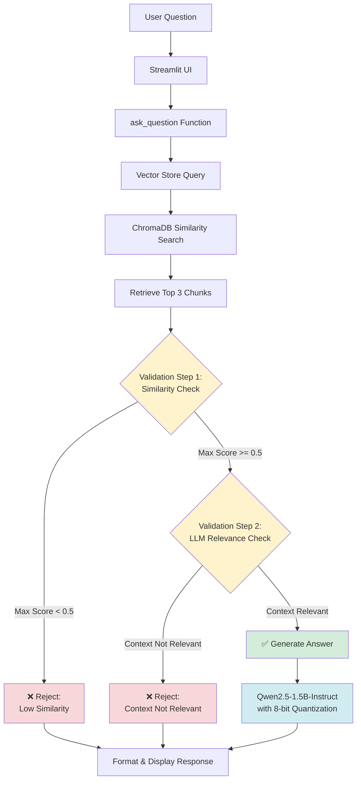

# ⚖️ Know Your Rights AI

> **Making legal information accessible through AI-powered conversational interface**

An intelligent Retrieval-Augmented Generation (RAG) chatbot that provides accessible information about Indian legal rights and regulations. Built with state-of-the-art language models and optimized for consumer-grade hardware.

> Demo video: https://drive.google.com/file/d/1MLs0fyorgcKoen2RaEafGD2g9HDccACi/view?usp=sharing
---

## 🌟 Features

### 🎯 Core Capabilities

- **RAG Architecture**: Combines document retrieval with language generation for accurate, context-aware responses
- **Two-Step Validation System**:
  - Similarity score threshold checking to filter irrelevant documents
  - LLM-based context relevance validation to ensure quality answers
  - Graceful rejection of out-of-scope questions with helpful guidance
- **GPU Optimization**: 8-bit quantization for efficient inference on 4GB VRAM GPUs
- **CPU Fallback**: Automatic CPU mode when GPU is unavailable
- **Beautiful UI**: Custom neomorphic design with Streamlit

### 📚 Document Coverage

The system provides information on:

- 🏢 **Labour Codes and Employment Rights** - New Four Labour Codes
- 🛒 **Consumer Rights and Protection** - Consumer Handbook
- 🔐 **Cyber Laws** - DPDP Act 2023, IT Intermediary Guidelines 2026
- 👩 **Women's Rights** - POCSO Act 2012, Women's Rights Handbook, CyberSaheli
- 📱 **Telecommunication Act 2023**
- 🎮 **Online Gaming Regulations 2025**
- 🎓 **Student Rights** - UGC Guidelines

---

## 🛠️ Technology Stack

| Component          | Technology            | Purpose                                   |
| ------------------ | --------------------- | ----------------------------------------- |
| **LLM**            | Qwen2.5-1.5B-Instruct | Answer generation with 8-bit quantization |
| **Embeddings**     | all-MiniLM-L6-v2      | Document and query vectorization          |
| **Vector Store**   | ChromaDB              | Persistent document storage and retrieval |
| **UI Framework**   | Streamlit             | Interactive web interface                 |
| **PDF Processing** | pypdf                 | Document ingestion                        |
| **Text Splitting** | LangChain             | Intelligent document chunking             |

### Key Dependencies

```
transformers
torch
sentence-transformers
chromadb
streamlit
pypdf
langchain-text-splitters
bitsandbytes (for GPU quantization)
```

---

## 💻 System Requirements

### Minimum Requirements

- **Python**: 3.8 or higher
- **RAM**: 8GB (16GB recommended)
- **Storage**: 5GB free space
- **OS**: Windows, Linux, or macOS

### GPU Requirements (Optional but Recommended)

- **VRAM**: 4GB minimum (NVIDIA GPU)
- **CUDA**: Compatible CUDA installation
- **Performance**: ~3-5 seconds per response with GPU vs ~15-30 seconds on CPU

### CPU-Only Mode

The system automatically falls back to CPU mode if no GPU is detected. Response times will be slower but functionality remains intact.

---

## 📖 Usage

### Basic Usage

1. **Launch the app**
2. **Enter your question** in the text area
3. **Click "Get Answer"** to receive a response
4. **Review the answer** based on retrieved legal documents

### Example Queries

```
✅ "What are my rights as an employee under the new labour codes?"
✅ "How can I file a consumer complaint?"
✅ "What are the provisions of the DPDP Act 2023?"
✅ "What are women's rights under POCSO Act?"
✅ "What are student rights according to UGC guidelines?"
```

### Out-of-Scope Queries

The system will politely reject questions that are:

- Not related to legal rights
- Outside the document coverage area
- General knowledge questions
- Questions about laws from other countries

Example:

```
❌ "What is the weather today?"
❌ "What are traffic rules in California?"
❌ "How do I bake a cake?"
```

---

## 📁 Project Structure

```
know-your-rights-ai/
│
├── app.py                          # Main Streamlit application
├── ingest_documents.py             # Document ingestion script
├── requirements.txt                # Python dependencies
│
├── data/                           # PDF documents (input)
│   ├── A Compendium on new Four Labour Codes.pdf
│   ├── Consumer_Handbook.pdf
│   ├── DPDP ACT 2023.pdf
│   ├── POCSO ACT 2012.pdf
│   └── ... (other legal documents)
│
├── embeddings/                     # ChromaDB vector store (generated)
│   ├── chroma.sqlite3
│   └── [collection directories]
│
├── prompts/                        # System prompts
│   ├── chat_prompt.txt            # Main chat prompt template
│   └── relevance_check_prompt.txt # Relevance validation prompt
│
├── utils/                          # Utility modules
│   ├── chatbot.py                 # Core RAG logic and LLM interface
│   ├── pdf_loader.py              # PDF text extraction
│   ├── vector_store.py            # ChromaDB operations
│   ├── prompt_loader.py           # Prompt loading utilities
│   ├── summarizer.py              # (Reserved for future use)
│   └── translator.py              # (Reserved for future use)
│
└── tests/                          # Test scripts
    ├── test.py                    # Basic functionality tests
    ├── test_context_validation.py # Validation system tests
    ├── test_granite.py            # Alternative model tests
    └── test_hf.py                 # HuggingFace API tests
```

### Key Files Description

| File                         | Purpose                                                  |
| ---------------------------- | -------------------------------------------------------- |
| `app.py`                     | Streamlit UI with neomorphic design and user interaction |
| `ingest_documents.py`        | Processes PDFs and stores them in vector database        |
| `utils/chatbot.py`           | RAG pipeline, validation logic, and LLM inference        |
| `utils/vector_store.py`      | ChromaDB operations and similarity search                |
| `utils/pdf_loader.py`        | PDF text extraction using pypdf                          |
| `test_context_validation.py` | Comprehensive validation testing suite                   |

---

## ⚙️ Configuration

### Model Settings (`utils/chatbot.py`)

```python
# LLM Configuration
MODEL_ID = "Qwen/Qwen2.5-1.5B-Instruct"  # Language model

# Validation Thresholds
MIN_SIMILARITY_THRESHOLD = 0.5  # Minimum similarity score (0.0-1.0)
N_RESULTS = 3                   # Number of chunks to retrieve

# Generation Parameters
max_new_tokens = 150            # Maximum response length
do_sample = False               # Greedy decoding (faster)
num_beams = 1                   # No beam search (faster)
```

### Vector Store Settings (`utils/vector_store.py`)

```python
# Embedding Model
model = SentenceTransformer("all-MiniLM-L6-v2")

# Text Chunking
chunk_size = 1000               # Characters per chunk
chunk_overlap = 200             # Overlap between chunks
```

### Tuning Recommendations

**If getting too many rejections:**

- Lower `MIN_SIMILARITY_THRESHOLD` (try 0.4 or 0.45)
- Increase `N_RESULTS` (try 5)

**If getting irrelevant answers:**

- Raise `MIN_SIMILARITY_THRESHOLD` (try 0.6 or 0.65)
- Decrease `N_RESULTS` (try 2)

**For faster responses:**

- Reduce `max_new_tokens` (try 100)
- Reduce `N_RESULTS` (try 2)

**For more detailed answers:**

- Increase `max_new_tokens` (try 200-300)
- Increase `N_RESULTS` (try 4-5)

---

## 🏗️ Architecture

### RAG Pipeline Flow



### Two-Step Validation System

#### Step 1: Similarity Score Filtering

- **Purpose**: Quick filtering of irrelevant documents
- **Method**: L2 distance converted to similarity score
- **Formula**: `similarity = 1 / (1 + distance)`
- **Threshold**: 0.5 (configurable)
- **Action**: Reject if all retrieved chunks have similarity < threshold

#### Step 2: LLM Relevance Validation

- **Purpose**: Deep semantic validation of context relevance
- **Method**: LLM evaluates if context can answer the question
- **Response**: Binary YES/NO decision
- **Action**: Reject if LLM determines context is not relevant

### Similarity Score Interpretation

| Distance | Similarity | Interpretation                 |
| -------- | ---------- | ------------------------------ |
| 0.0      | 1.00       | Perfect match                  |
| 0.5      | 0.67       | High relevance                 |
| 1.0      | 0.50       | Moderate relevance (threshold) |
| 1.5      | 0.40       | Low relevance                  |
| 2.0      | 0.33       | Very low relevance             |

---

## 🎨 UI Design

The application features a custom **neomorphic design** with:

- 🎨 Soft shadows and highlights for depth
- 🌈 Warm color palette (#E8DDD3 base)
- 📱 Responsive layout for mobile and desktop
- ⚡ Smooth animations and transitions
- 🔤 Inter font family for modern typography

### Design Philosophy

- **Accessibility**: High contrast text, clear visual hierarchy
- **Simplicity**: Minimal interface focusing on core functionality
- **Professionalism**: Legal context requires trustworthy design
- **User Experience**: Intuitive interaction patterns

---

## 🔧 Troubleshooting

### Common Issues

#### 1. GPU Not Detected

**Symptom**: Model loads on CPU despite having GPU
**Solution**:

```bash
# Check CUDA availability
python -c "import torch; print(torch.cuda.is_available())"

# Install CUDA-compatible PyTorch
pip install torch torchvision torchaudio --index-url https://download.pytorch.org/whl/cu118
```

#### 2. Out of Memory Error

**Symptom**: CUDA out of memory error
**Solution**:

- Reduce `max_new_tokens` in `utils/chatbot.py`
- Reduce `N_RESULTS` to retrieve fewer chunks
- Close other GPU-intensive applications

#### 3. Slow Response Times

**Symptom**: Responses take >30 seconds
**Solution**:

- Ensure GPU is being used (check console output)
- Reduce `max_new_tokens` for faster generation
- Consider using a smaller model or CPU-optimized settings

#### 4. ChromaDB Errors

**Symptom**: Collection not found or database errors
**Solution**:

```bash
# Re-ingest documents
rm -rf embeddings/
python ingest_documents.py
```

#### 5. Import Errors

**Symptom**: Module not found errors
**Solution**:

```bash
# Reinstall dependencies
pip install -r requirements.txt --force-reinstall
```

---

## 🚀 Performance Optimization

### GPU Mode (Recommended)

- **Model**: Qwen2.5-1.5B with 8-bit quantization
- **VRAM Usage**: ~1.5GB
- **Response Time**: 3-5 seconds

### CPU Mode (Fallback)

- **Model**: Qwen2.5-1.5B (full precision)
- **RAM Usage**: ~3GB
- **Response Time**: 15-30 seconds

### Optimization Tips

1. **Use GPU**: Significantly faster inference
2. **Reduce Token Length**: Lower `max_new_tokens` for faster responses
3. **Cache Models**: Streamlit caching prevents reloading on reruns
4. **Optimize Chunks**: Adjust `chunk_size` and `chunk_overlap` for better retrieval
5. **Batch Processing**: Process multiple documents at once during ingestion

---

## ⚠️ Disclaimer

**IMPORTANT LEGAL NOTICE**

Know Your Rights AI is an **educational and informational tool only**. It:

- ❌ Does NOT provide legal advice
- ❌ Does NOT provide legal opinions
- ❌ Does NOT provide legal representation
- ❌ Is NOT a substitute for a qualified lawyer

**Always consult a qualified legal professional for:**

- Specific legal matters
- Legal advice tailored to your situation
- Representation in legal proceedings
- Interpretation of laws and regulations

The information provided by this system is based on the documents in its knowledge base and may not reflect the most current legal developments. Laws and regulations change frequently.

---

## 🙏 Acknowledgments

### Technologies

- **Qwen Team** - For the excellent Qwen2.5 language models
- **Sentence Transformers** - For efficient embedding models
- **ChromaDB** - For vector database capabilities
- **Streamlit** - For the amazing web framework
- **Hugging Face** - For model hosting and transformers library

### Legal Documents

This project uses publicly available legal documents and handbooks published by:

- Government of India
- Ministry of Labour and Employment
- Ministry of Consumer Affairs
- Ministry of Electronics and Information Technology
- University Grants Commission (UGC)
- Various legal awareness organizations

### Inspiration

Built to make legal information more accessible to everyone, especially those who may not have easy access to legal counsel.

---

## Future Enhancements

- [ ] Support for more document formats (DOCX, HTML, etc.)
- [ ] Real-time document updates
- [ ] User authentication and history
- [ ] Customizable UI themes
- [ ] Export answers as PDF
- [ ] Integration with legal databases
- [ ] Multi-language support

---

<div align="center">

**Made with ❤️ for legal awareness and accessibility**

⚖️ **Know Your Rights AI** ⚖️

_Empowering citizens through accessible legal information_

</div>
